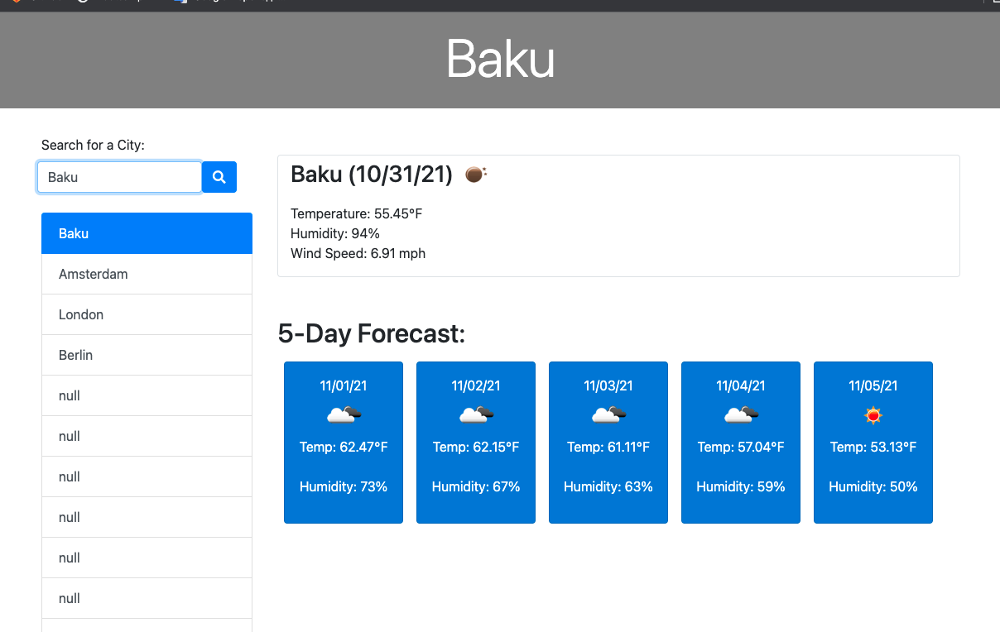

## WeatherApp

#Description
This application allows a travelers to search for current and 5 day forecast of weather for a particular city. When user enters a city name and press search button, both current and 5 day forecast is being displayed on the screen. Searched city is added to the history and user can always press on the searched city to see results again. This app utilize Open Weather Map API.

#Technology utilized
HTML and CSS was utilized for the front end of the web page. JavaScript is used to implement logic behind obtaining weather data using API, saving and retriveing data, powered by JQuery it also allows to dynamically update HTML and CSS parts of the application and handle timing with Momentjs.

#Usage
Please open the website using following link: https://zahramammadli.github.io/WeatherApp/.

Please input the city name and press on search button.Once done you will be displayed with current and five day forecast for the city you choosed.If you want to cross check again particular city you have already searched you can press on the city name from the search history.

You can find screenshot of the page in the assets folder, follow link below:

PageLink
GitLink: https://zahramammadli.github.io/WeatherApp/
GitHub: https://github.com/ZahraMammadli/WeatherApp/
